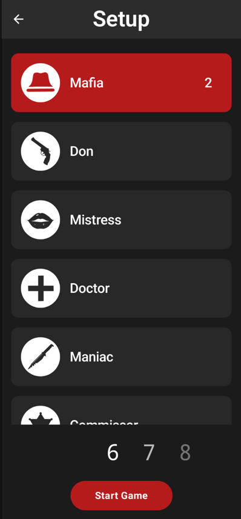
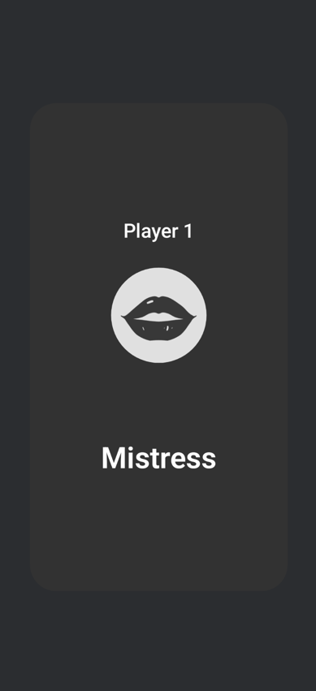

# 🕵️‍♂️ MafiaMaster 

**MafiaMaster**

is a cross-platform mobile game inspired by the classic social deduction game "Mafia." Built with Kotlin Multiplatform Mobile (KMM), it allows players to engage in thrilling gameplay on both Android and iOS devices.

---
# 🛠️ Tech stack

- Kotlin Multiplatform
- Compose Multiplatform
- Koin

---
# 🗂️ Project structure

```
MafiaMaster/
├── androidApp/       # Android-specific code and resources
├── iosApp/           # iOS-specific code and resources
├── shared/           # Shared Kotlin code (business logic, models, etc.)
│   ├── app/          # Application-level shared logic
│   ├── core/         # Core utilities and abstractions
│   ├── feature/      # Modular features (e.g., roles, game setup)
├── build-logic/      # Included builds for easier dependency management
├── gradle/           # Gradle wrapper and configuration
├── .idea/            # IntelliJ IDEA project settings
├── build.gradle.kts  # Root Gradle build script
├── settings.gradle.kts
└── ...
```

---
# 📸 Previews



